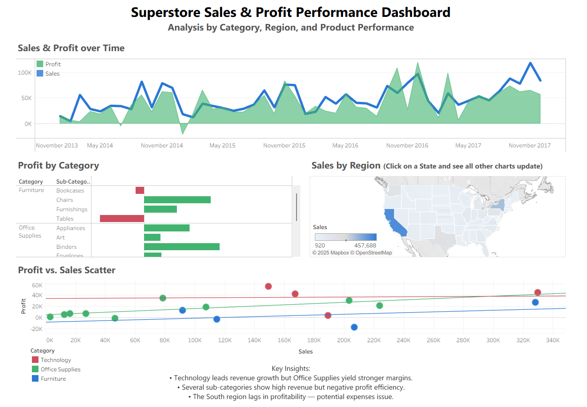

# 📊 Superstore Sales & Profit Performance Dashboard
Interactive Tableau dashboard analyzing sales and profit performance across product categories, time, and U.S. regions using the Sample Superstore dataset.

## 🎯 Overview
This visualization answers key business performance questions:
- How have Sales and Profit trended over time?
- Which product categories and sub-categories are most profitable?
- Which regions drive the strongest sales performance?
- Are high sales always leading to high profit? Or are some products being sold at a loss?
The dashboard allows users to explore performance from multiple business angles, interactively.

## 🧭 Features
---
1. Sales & Profit Over Time
A dual-axis time-series chart showing:
- Sales (line) to represent revenue.
- Profit (area) to represent earnings.
This makes divergence visible (e.g., high sales + low profit = margin pressure).
---
2. Profit by Category
Horizontal bar chart that breaks down:
- Product Categories and Sub-Categories
- Showing which product lines drive profit and which produce losses.
Reveals margin inefficiencies clearly.
---
3. Sales by Region (Interactive Map - all data adjusts when you click on a state to show only data of that specific state in the other charts)
A filled map showing:
- Sales performance across U.S. States
- Light = Low Sales; Dark = High Sales
Quickly highlights strong territories.

4. Profit vs Sales Scatter Plot
- X-axis: Sales
- Y-axis: Profit
Color: Product Category
This helps identify high and low performers and
Inefficient Sub-Categories (high sales + negative profit).

---

## 🖼️ Preview

